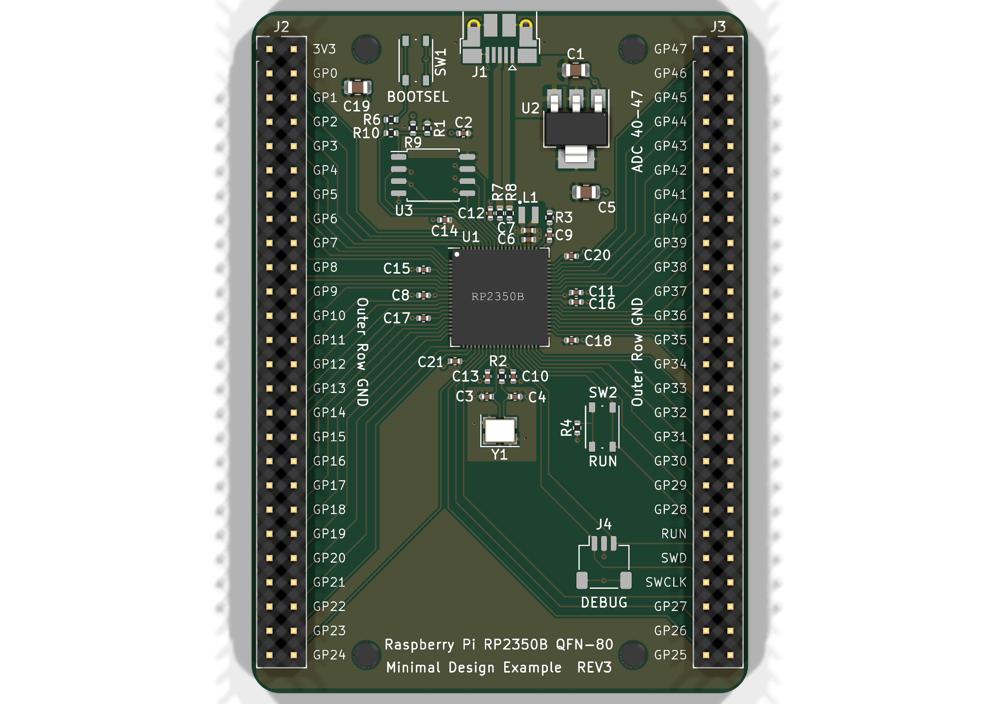

# RP2350B Minimal Board — AI-Assisted, Gate-Verified KiCad Project

A Raspberry Pi **RP2350B (QFN-80)** minimal development board, taken from the official reference
design to a **fab-ready, evidence-verified state** by a gated, evidence-first hardware pipeline
with a human decision at every gate.

| | |
|---|---|
| MCU | RP2350B, QFN-80 10×10 mm (order **A4 stepping only** — E9 erratum fixed in A4) |
| Board | 52.6 × 72.1 mm, 2-layer, all 48 GPIOs broken out (8 ADC-capable) |
| Design state | Schematic **ERC: 0 errors** · PCB **DRC: 0 errors**, 73/73 nets connected |
| EDA | KiCad 10.0.4 (design migrated from the official KiCad 7 files, equivalence-proven) |

**Top view** — [checks/pcb_top.png](checks/pcb_top.png) · **Bottom** — [checks/pcb_bottom.png](checks/pcb_bottom.png) · **Schematic PDF** — [checks/schematic_review.pdf](checks/schematic_review.pdf)

## Open the design in KiCad

Two ways:
1. **No git needed**: download [RP2350B_minimal_kicad_project.zip](RP2350B_minimal_kicad_project.zip)
   (or the repo ZIP via *Code ▾ → Download ZIP*), unzip, then double-click
   `design/RP2350_80QFN_minimal.kicad_pro`.
2. `git clone https://github.com/Adidez/rp2350b-minimal-board && open design/RP2350_80QFN_minimal.kicad_pro`

Requires **KiCad 9 or 10** (files are v10 format; project-local symbol + footprint libraries and
the STEP model are included, so it opens fully self-contained — no library setup needed).



## What was actually done (the story)

1. **Stage 0 — Baseline.** Copied the official RP2350B minimal reference (KiCad 7) and migrated
   it under KiCad 10: installed global library tables (117 of 193 findings were phantom config
   noise), added the two missing `PWR_FLAG` declarations on the internal-VREG rails
   (`+1V1`, `VREG_AVDD`) that took ERC from 2 errors → 0, and re-linked a footprint KiCad 10
   renamed. Every schematic edit was proven by **netlist equivalence** — 75/75 nets,
   membership byte-identical.
2. **Stage 1 — Sourcing.** All 39 fitted parts got `MPN` + `LCSC` properties (hidden fields —
   the drawing stays clean) and a per-part datasheet corpus. Live-stock-checked ordering table:
   [checks/G1_gate_report.md](checks/G1_gate_report.md). One engineered substitution
   (Würth button → ALPS SKRPACE010, land-pattern-verified). 9 of 17 lines are JLCPCB Basic tier.
3. **Stage 2/3 — Layout verification.** The official routing was independently re-verified under
   modern checkers: 0 electrical DRC findings, full connectivity (511 segments / 48 vias /
   332 pads), USB pair geometry sound for full-speed, solid bottom GND plane. A false-positive
   severity policy from the KiCad-7 project file was fixed at root cause.
   Evidence: [checks/G3_prevalidation.md](checks/G3_prevalidation.md).
4. **Stage 4 — Fab package: DONE (Gate G4 PASS).** [fab/](fab/) holds the upload-ready set:
   [gerber zip](fab/RP2350B_minimal_gerbers.zip) (7 Protel-ext layers + PTH/NPTH drills,
   drill-count reconciled exactly against the design), [BOM](fab/bom_jlcpcb.csv) (17 lines,
   100% LCSC-resolved), [CPL](fab/cpl_jlcpcb.csv) (39 parts) and
   [ROTATION_NOTES.md](fab/ROTATION_NOTES.md). Release-gate evidence:
   [checks/G4_fab_release_gate.txt](checks/G4_fab_release_gate.txt).

Full audit trail: `git log` — every gate closes with its own commit and report in [checks/](checks/).

## Repository map

```
design/       The working KiCad project (schematic + routed PCB) — ERC/DRC clean
reference/    Official Raspberry Pi minimal design (untouched) + hardware design guide PDF
checks/       Gate reports + ERC/DRC JSON evidence + renders (the generated documents)
datasheets/   Per-MPN vendor datasheets (17) + manifest
fab/          JLCPCB-ready package: gerber zip, assembly BOM (LCSC), CPL, rotation notes
.claude/      The pipeline skill: stage gates, RP2350B design rules, toolchain quirks
```

## The design rules that matter (and that generic AI gets wrong)

- **A4 stepping only** (`RP2350B0A4`, LCSC C9900208890): A2 has erratum E9 (GPIO input-mode
  leakage ~120 µA, latches ~2.2 V). Verify at bring-up via `rp2350_chip_version()`.
- The RP2350 core regulator is a **switcher, not an LDO**: the 3.3 µH inductor
  (Abracon AOTA-B201610S3R3, **polarity dot**) is mandatory.
- `QSPI_SS` is the BOOTSEL strap and `QSPI SD1` selects the bootloader interface — neither may
  be loaded or biased at reset.
- Crystal is CL=10 pF (ABM8-272-T3) with tuned damping — don't substitute a 20 pF part without
  re-deriving load caps.
- Full list with sources: [.claude/skills/rp2350b-hardware-pipeline/references/rp2350b-design-rules.md](.claude/skills/rp2350b-hardware-pipeline/references/rp2350b-design-rules.md)

## Reproduce the verification yourself

```bash
KCLI=/Applications/KiCad/KiCad.app/Contents/MacOS/kicad-cli   # macOS bundle path
$KCLI sch erc --severity-all --output /tmp/erc.rpt design/RP2350_80QFN_minimal.kicad_sch   # → 0 errors
$KCLI pcb drc --severity-all --refill-zones --output /tmp/drc.rpt design/RP2350_80QFN_minimal.kicad_pcb  # → 0 errors
$KCLI pcb render --side top --output /tmp/top.png design/RP2350_80QFN_minimal.kicad_pcb
```

Expected residual warnings are documented (66 `endpoint_off_grid` + 6 `lib_symbol_mismatch` on
the schematic; 52 metadata findings on the PCB) — see the gate reports for the keep-rationale.

## Remaining path to a live board (human steps)

1. **Order at JLCPCB**: upload [fab/RP2350B_minimal_gerbers.zip](fab/RP2350B_minimal_gerbers.zip) +
   [BOM](fab/bom_jlcpcb.csv) + [CPL](fab/cpl_jlcpcb.csv). In the assembly preview, verify
   orientation of U1/U2/U3/J1/L1/Y1 against [checks/pcb_top.png](checks/pcb_top.png) — see
   [fab/ROTATION_NOTES.md](fab/ROTATION_NOTES.md). RP2350B **A4** (C9900208890) is a
   global-sourcing part — reserve early; re-verify all Extended-tier stock (table dated
   2026-07-07). Pick **Standard** assembly if J2/J3 headers should be machine-placed
   (Economic = SMD-only → hand-solder the headers).
2. **Bring-up**: 3V3 → 1V1 (proves VREG + inductor) → hold BOOTSEL, plug USB → mass-storage
   enumeration → flash a UF2 → confirm **A4** in silicon via `rp2350_chip_version()`.

## Attribution & licenses

- Base design: **Raspberry Pi Ltd** — "RP2350B QFN80 Minimal Design Example" from
  [Hardware design with RP2350](https://datasheets.raspberrypi.com/rp2350/hardware-design-with-rp2350.pdf)
  (© Raspberry Pi Ltd, redistributed with attribution; reference copy unmodified in `reference/`).
- Vendor datasheets in `datasheets/` remain the property of their respective manufacturers
  (Winbond, onsemi, Abracon, Samsung, UNI-ROYAL, ALPS, JST, Amphenol, XKB, Raspberry Pi).
- Verification tooling: [KiCad](https://kicad.org) 10.0.4 · [kicad-happy](https://github.com/aklofas/kicad-happy)
  (analysis) · [KiCadRoutingTools](https://github.com/drandyhaas/KiCadRoutingTools) (post-route checks).
- Pipeline definition: project-specific gated skill
  ([.claude/skills/rp2350b-hardware-pipeline](.claude/skills/rp2350b-hardware-pipeline)).
